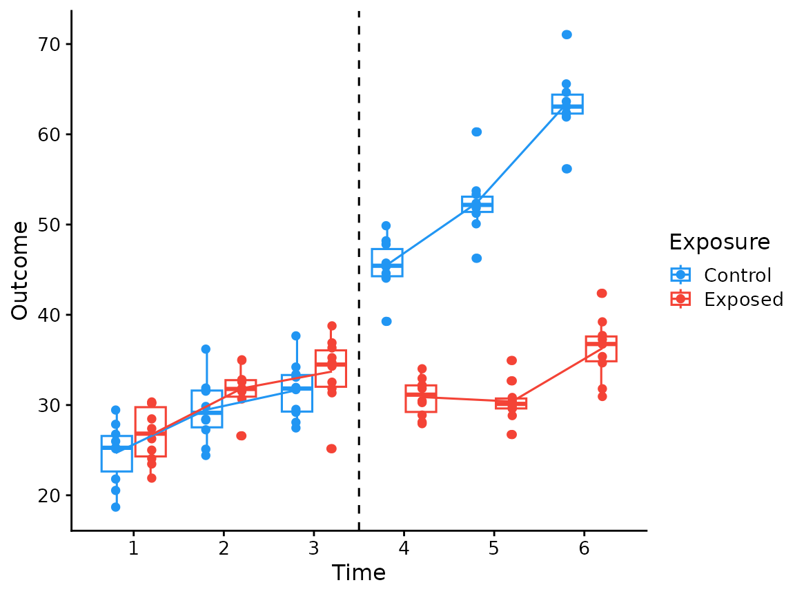

# Interrupted Time Series (ITS) in R

``` r
# Packages used in the analysis
library(marginaleffects) # predictions(), slopes(), hypotheses()
library(ggplot2) # plotting
library(cowplot) # plotting theme
library(see) # color palette
library(dplyr) # data manipulation
library(tidyr) # uncount()
library(forcats) # fct_cross()
```

## Data generation

In an interrupted time series design, outcomes are measured repeatedly
over time for two groups (here, Control and Exposed), and a common
intervention occurs partway through the observation period. We generate
a synthetic dataset with 6 time points and an intervention between time
points 3 and 4. Ten subjects are simulated per time-by-group cell, with
outcomes drawn from a normal distribution around known group means.

The key derived variable is `grp`, a four-level factor created by
crossing the intervention period (Pre / Post) with the exposure status
(Control / Exposed). This encodes the four distinct trajectories in the
data: `Pre_Control`, `Pre_Exposed`, `Post_Control`, and `Post_Exposed`.

``` r
# Generate a synthetic ITS dataset
df <- expand.grid(
  time = 1:6,
  exposed = 0:1
) |>
  mutate(mean = c(26, 30, 32, 45, 52, 63, 27, 31, 33, 29, 32, 36)) |>
  uncount(weights = 10, .id = "id") |>
  mutate(
    outcome = mean + rnorm(n = n(), sd = 3),
    intervention = as.numeric(time > 3) |>
      factor(levels = c(0, 1), labels = c("Pre", "Post")),
    exposed = factor(
      exposed,
      levels = c(0, 1),
      labels = c("Control", "Exposed")
    ),
    grp = fct_cross(intervention, exposed, sep = "_") # 4-level group variable
  )
```

## Exploratory plot

Before fitting a model, it is useful to visualize the raw data alongside
group means to inspect the trajectory of each group across time and the
apparent effect of the intervention. The dashed vertical line marks the
intervention point (between time 3 and time 4).

``` r
df |>
  mutate(exp_time = paste0(exposed, "_", time)) |>
  ggplot(aes(x = time, y = outcome, color = exposed)) +
  geom_boxplot(aes(group = exp_time), fill = NA) +
  geom_vline(xintercept = 3.5, linetype = "dashed") +
  geom_point(aes(group = exp_time), position = position_dodge(width = 0.8)) +
  stat_summary(
    aes(group = grp),
    geom = "line",
    fun = mean,
    position = position_dodge(width = 0.8)
  ) +
  scale_x_continuous(breaks = 1:6) +
  see::scale_color_material(name = "Exposure") +
  labs(x = "Time", y = "Outcome") +
  cowplot::theme_cowplot(12)
```



## Fit the model

We fit a linear model that allows each group to have its own intercept
and its own time slope. Removing the global intercept (`- 1`) means the
four levels of `grp` directly estimate the group-specific baseline
values. The `grp:time` interaction then gives each group its own rate of
change over time, so the model can capture both a level shift and a
slope change at the intervention.

``` r
# Group-specific intercepts and time slopes; no global intercept
model <- lm(outcome ~ grp + grp:time - 1, data = df)
parameters::parameters(model)
#> Parameter                 | Coefficient |   SE |         95% CI | t(112) |      p
#> ---------------------------------------------------------------------------------
#> grp [Pre_Control]         |       21.64 | 1.57 | [18.52, 24.75] |  13.78 | < .001
#> grp [Pre_Exposed]         |       23.78 | 1.57 | [20.67, 26.89] |  15.14 | < .001
#> grp [Post_Control]        |        8.92 | 3.68 | [ 1.62, 16.21] |   2.42 | 0.017 
#> grp [Post_Exposed]        |       19.00 | 3.68 | [11.70, 26.30] |   5.16 | < .001
#> grp [Pre_Control] × time  |        3.48 | 0.73 | [ 2.04,  4.92] |   4.78 | < .001
#> grp [Pre_Exposed] × time  |        3.49 | 0.73 | [ 2.05,  4.93] |   4.80 | < .001
#> grp [Post_Control] × time |        8.96 | 0.73 | [ 7.52, 10.40] |  12.33 | < .001
#> grp [Post_Exposed] × time |        2.70 | 0.73 | [ 1.26,  4.15] |   3.72 | < .001
```

## Estimated marginal means

We compute the predicted outcome at each time point for each group
combination. These marginal means integrate out subject-level
variability and provide a clean summary of the fitted trajectories.

``` r
# Average predicted values at each time × group combination
preds <- predictions(
  model,
  by = c("time", "grp")
)
preds
#> 
#>  time          grp Estimate Std. Error    z Pr(>|z|)      S 2.5 % 97.5 %
#>     1 Pre_Control      25.1      0.939 26.8   <0.001  521.5  23.3   27.0
#>     1 Pre_Exposed      27.3      0.939 29.1   <0.001  614.3  25.4   29.1
#>     2 Pre_Control      28.6      0.594 48.2   <0.001    Inf  27.4   29.8
#>     2 Pre_Exposed      30.8      0.594 51.8   <0.001    Inf  29.6   31.9
#>     3 Pre_Control      32.1      0.939 34.2   <0.001  847.5  30.2   33.9
#>     3 Pre_Exposed      34.3      0.939 36.5   <0.001  966.3  32.4   36.1
#>     4 Post_Control     44.8      0.939 47.7   <0.001    Inf  42.9   46.6
#>     4 Post_Exposed     29.8      0.939 31.8   <0.001  733.4  28.0   31.7
#>     5 Post_Control     53.7      0.594 90.5   <0.001    Inf  52.6   54.9
#>     5 Post_Exposed     32.5      0.594 54.8   <0.001    Inf  31.4   33.7
#>     6 Post_Control     62.7      0.939 66.8   <0.001    Inf  60.9   64.5
#>     6 Post_Exposed     35.2      0.939 37.5   <0.001 1021.7  33.4   37.1
#> 
#> Type: response
```

## Level change at intervention

The level change captures the immediate shift in outcome at the
intervention boundary, defined here as the difference between time 3
(last pre-intervention time point) and time 4 (first post-intervention
time point) within each group. We build contrast vectors by logical
indexing into `preds`, then pass them to
[`hypotheses()`](https://marginaleffects.com/man/r/hypotheses.html) to
test three quantities simultaneously: the level change in the Control
group, the level change in the Exposed group, and the difference between
the two (i.e., whether the intervention had a differential effect on
level).

``` r
# Contrast vectors: pre-intervention endpoint minus post-intervention starting point
ctrl <- with(preds, time == 3 & grp == "Pre_Control") -
  with(preds, time == 4 & grp == "Post_Control")
exp <- with(preds, time == 3 & grp == "Pre_Exposed") -
  with(preds, time == 4 & grp == "Post_Exposed")

# Test level changes and their difference
hypotheses(
  preds,
  hypothesis = cbind(
    "Control" = ctrl,
    "Exposed" = exp,
    "Difference" = exp - ctrl
  )
)
#> 
#>        Term Estimate Std. Error     z Pr(>|z|)    S  2.5 % 97.5 %
#>  Control      -12.70       1.33 -9.57   <0.001 69.6 -15.30 -10.10
#>  Exposed        4.44       1.33  3.34   <0.001 10.2   1.83   7.04
#>  Difference    17.14       1.88  9.13   <0.001 63.7  13.46  20.81
```

## Trend analysis

Beyond a level shift, the intervention may also alter the rate of change
over time (i.e., the slope). We use
[`slopes()`](https://marginaleffects.com/man/r/slopes.html) to estimate
the time trend within each group-period combination, yielding four slope
estimates (Pre_Control, Post_Control, Pre_Exposed, Post_Exposed). We
then use
[`hypotheses()`](https://marginaleffects.com/man/r/hypotheses.html) to
test three contrasts: the change in slope from Pre to Post for the
Control group, the same change for the Exposed group, and the
difference-in-slopes between the two groups (an estimate of the
differential trend effect of the intervention).

``` r
# Estimate time slopes within each group × period combination
trends <- slopes(
  model,
  variables = "time",
  by = "grp"
)
trends
#> 
#>           grp Estimate Std. Error     z Pr(>|z|)     S 2.5 % 97.5 %
#>  Pre_Control      3.48      0.727  4.78   <0.001  19.1  2.05   4.90
#>  Pre_Exposed      3.49      0.727  4.80   <0.001  19.3  2.06   4.91
#>  Post_Control     8.96      0.727 12.33   <0.001 113.6  7.54  10.39
#>  Post_Exposed     2.70      0.727  3.72   <0.001  12.3  1.28   4.13
#> 
#> Term: time
#> Type: response
#> Comparison: dY/dX
```

``` r
# Test the change in trend from Pre to Post, and the difference between groups
hypotheses(
  trends,
  hypothesis = c(
    "Control" = "b2 - b1 = 0",
    "Exposed" = "b4 - b3 = 0",
    "Difference" = "(b4 - b3) - (b2 - b1) = 0"
  )
)
#> 
#>  Hypothesis Estimate Std. Error       z Pr(>|z|)    S 2.5 % 97.5 %
#>  Control      0.0129       1.03  0.0126     0.99  0.0 -2.00   2.03
#>  Exposed     -6.2579       1.03 -6.0878   <0.001 29.7 -8.27  -4.24
#>  Difference  -6.2708       1.45 -4.3134   <0.001 15.9 -9.12  -3.42
```
